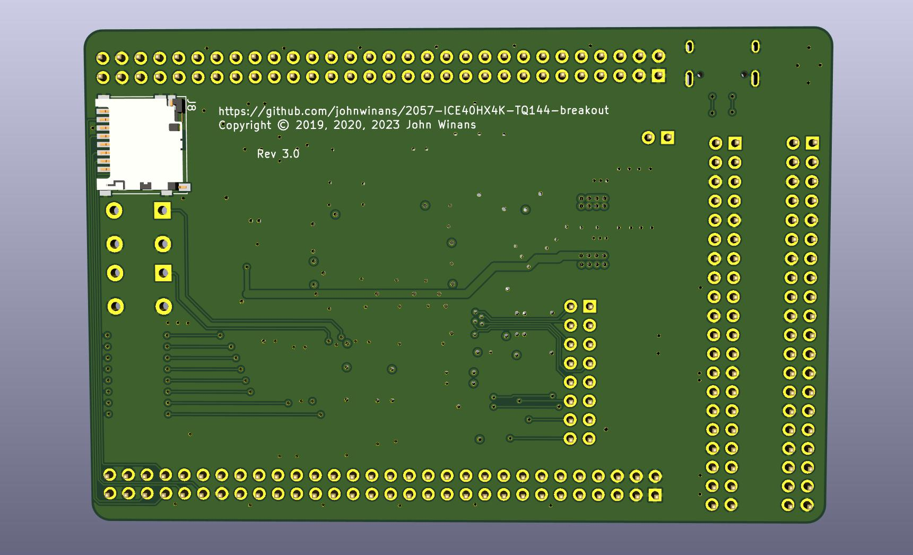

# 2057-ICE40HX4K-TQ144-breakout
Minimal Raspberry PI breakout board for ICE40HX4K FPGA

Rev 3.0 has been built!
All features except for the SD card have been tested and are working properly. (Stay tuned for SD card test results).

Example test programs can be found in the [verilog](./verilog) directory.

The BOM (Bill Of Materials) can be found in [2057-ICE40HX4K-TQ144-breakout.md](./2057-ICE40HX4K-TQ144-breakout.md).

## See The Following Repos For Installing Development Tools and Example Code

- [YouTube Playlist](https://www.youtube.com/playlist?list=PL3by7evD3F52On-ws9pcdQuEL-rYbNNFB) discussing Verilog & using this breakout board
- [Raspberry PI Setup](https://github.com/johnwinans/raspberry-pi-install)
- [Icarus Setup & Example Programs](https://github.com/johnwinans/IceStick-Examples-Icarus) (For simulation and debugging)
- [More Example Programs](https://github.com/johnwinans/Verilog-Examples) (More example programs)

# iCE40 Docs

Family page:

- iCE40 Family [page](https://www.latticesemi.com/iCE40)

Direct links to my favorite documents:

- iCE40 LP/HX Datasheet [pdf](https://www.latticesemi.com/view_document?document_id=49312)
- iCE40 Programming and Configuration Techincal Note TN1248 [pdf](https://www.latticesemi.com/view_document?document_id=46502)
- iCE40 sysCLOCK PLL Design and User Guide [pdf](https://www.latticesemi.com/view_document?document_id=47778)
- Memory Usage Guide for iCE40 Devices [pdf](https://www.latticesemi.com/view_document?document_id=47775)
- It looks like updated versions of various manuals appear here: https://www.latticesemi.com/Products/FPGAandCPLD/iCE40

# Release Notes

## Rev 1.1
- Board has been tested and is working properly.

## Rev 2.0
- Added a boot FLASH
- Added SD card

## Rev 3.0
- Change to use USB C connector for power
- Change SD card signals to connect to J1 (instead of J2)
- Change push buttons to use J1 (instead of J2)

# Alternate Parts

Substitutions for U4 (the FLASH chip) include:
- Digikey #1265-1035-1-ND AT45DB161E-SHD-T
- Digikey #1265-1041-1-ND AT45DB161E-SHD2B-T

If you substitute the FLASH then see the comments regarding setting the total number of bytes to program circa line 150 in: [verilog/prog-flash.sh](verilog/prog-flash.sh)

