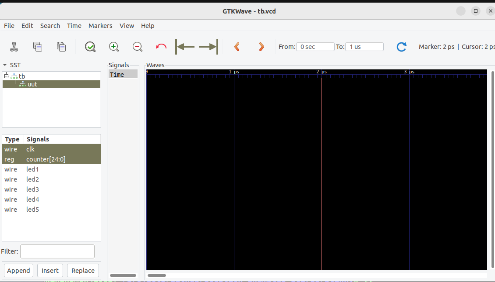

# Test Apps

These instructions have been verified on:
- Ubuntu 20.04.2 LTS 2023-06-24
- Raspbian GNU/Linux 11 (bullseye) 2023-06-24

# Install the tools

	sudo apt install fpga-icestorm
	sudo apt install arachne-pnr
	sudo apt install iverilog
	sudo apt install gtkwave

Note that on newer systems, the following may be preferred over `arachne-pnr`.  However, it 
may not be in the standard set of available packages.

	sudo apt install nextpnr-ice40

The make files in this project are configured to use arachne-pnr because, at the time of testing, nextpnr-ice40 was not a standard package on th Raspberry PI (that was used as the FLASH programmer.)

# To run these applications on the `2057-ICE40HX4K-TQ144-breakout`

Plug your Raspberry PI into your board and run the following from this cloned repo:

	git clone https://github.com/johnwinans/2057-ICE40HX4K-TQ144-breakout.git
	cd 2057-ICE40HX4K-TQ144-breakout/verilog/blinky
	make
	make flash

# To build and run icarus to simulate this project and view a waveform of the application

	make plot

In gtkwave, open (double-click) the 'tb' object in the tree, click on 'uut'. 

Then, in the signals box below click on the 'clk' signal and ctrl-click on 'counter[24:0]'
(so that they are both selected at the same time) and click the Append button at the 
bottom left.  

At this point, you can zoom and scroll around the waveform on the right to see the 
clock signal ticking and the counter advancing on the rising/positive edge of 
the 'clk' signal.

# iCE40 Docs

Family page:

- iCE40 Family [page](https://www.latticesemi.com/iCE40)

Direct links to my favorite documents:

- iCE40 LP/HX Datasheet [pdf](https://www.latticesemi.com/view_document?document_id=49312)
- iCE40 Programming and Configuration Techincal Note TN1248 [pdf](https://www.latticesemi.com/view_document?document_id=46502)
- iCE40 sysCLOCK PLL Design and User Guide [pdf](https://www.latticesemi.com/view_document?document_id=47778)
- Memory Usage Guide for iCE40 Devices [pdf](https://www.latticesemi.com/view_document?document_id=47775)
